# Praktikum Modul 1 Jarkom

|No|Nama anggota|NRP|
|---|---|---|
|1. | Az Zahrra Tasya Adelia | 5027241087|
|2. | Evan Christian Nainggolan | 5027241026|

# Laporan Praktikum Jaringan: Konfigurasi Jaringan Ainulindalë

## Deskripsi Proyek

Proyek ini bertujuan untuk membangun dan mengkonfigurasi sebuah topologi jaringan berdasarkan skenario "The Ainulindalë", dengan mengikuti prosedur dan konsep yang dijelaskan dalam **Modul Pengenalan GNS3**. Laporan ini merinci implementasi untuk setiap tahapan konfigurasi, mulai dari pembuatan topologi dasar hingga menyediakan konektivitas internet untuk semua node client.

## Topologi Jaringan

Topologi yang digunakan melibatkan satu node **Eru** sebagai Router pusat, dua Switch yang memisahkan empat node **Client** (Melkor, Manwe, Varda, Ulmo) ke dalam dua subnet, dan satu cloud **NAT** sebagai gerbang ke Internet. Semua node menggunakan image Docker `nevarre/gns3-debi:latest` sesuai ketentuan.


---

## Implementasi Skenario

Berikut adalah penjelasan untuk setiap objektif yang diselesaikan dalam praktikum, yang dihubungkan dengan materi dari modul.

### Soal 1: Konfigurasi Eru sebagai Router dan Pembuatan Segmen Jaringan

**Objektif:** Membangun fondasi jaringan dengan menjadikan Eru sebagai router pusat yang menghubungkan dua segmen jaringan (subnet) yang terisolasi untuk para Ainur.

**Konsep & Implementasi :**
Sesuai dengan bagian **"Membuat Topologi"** pada modul, konfigurasi jaringan untuk setiap node dilakukan melalui fitur GNS3 **"Edit network configuration"**.

1.  **Eru sebagai Gateway:** Node Eru dikonfigurasi dengan dua antarmuka jaringan statis (`eth1` dan `eth2`). Setiap antarmuka diberikan alamat IP yang unik (`10.71.1.1` dan `10.71.2.1`) yang berfungsi sebagai **gateway** untuk masing-masing segmen jaringan yang terhubung ke Switch1 dan Switch2.<br>
<br>

Dimana konfigurasi node `Eru` :
```
auto eth0
iface eth0 inet dhcp

auto eth1
iface eth1 inet static
	address 10.71.1.1
	netmask 255.255.255.0

auto eth2
iface eth2 inet static
	address 10.71.2.1
	netmask 255.255.255.0

up apt update && apt install iptables
up iptables -t nat -A POSTROUTING -o eth0 -j MASQUERADE -s 10.71.0.0/16
```

2.  **Client di Setiap Segmen:** Setiap node client (Melkor, Manwe, Varda, Ulmo) juga dikonfigurasi melalui "Edit network configuration". Mereka diberikan alamat IP statis yang sesuai dengan subnetnya. Parameter **`gateway`** di dalam konfigurasi setiap client diisi dengan alamat IP antarmuka Eru yang relevan, mengarahkan semua trafik eksternal mereka melalui Eru.<br>
<br>

Dimana konfigurasi node `Melkor` :
```
auto eth0
iface eth0 inet static
	address 10.71.1.2
	netmask 255.255.255.0
	gateway 10.71.1.1
```

Dimana konfigurasi node `Manwe` :
```
auto eth0
iface eth0 inet static
	address 10.71.1.3
	netmask 255.255.255.0
	gateway 10.71.1.1
```

Dimana konfigurasi node `Varda` :
```
auto eth0
iface eth0 inet static
	address 10.71.2.2
	netmask 255.255.255.0
	gateway 10.71.2.1
```

Dimana konfigurasi node `Ulmo` :
```
auto eth0
iface eth0 inet static
	address 10.71.2.3
	netmask 255.255.255.0
	gateway 10.71.2.1
```

### Soal 2: Menghubungkan Eru ke Internet

**Objektif:** Memberikan konektivitas internet kepada node router Eru agar ia dapat berkomunikasi dengan dunia luar.

**Konsep & Implementasi :**
Mengikuti panduan **"Akses Sebuah Node ke Internet"**, antarmuka `eth0` pada Eru dihubungkan ke node **NAT** GNS3. Konfigurasi untuk mendapatkan IP secara otomatis dilakukan dengan mengedit file network configuration Eru. Untuk menyambungkan Eru dan internet diperlukan untuk menjalankan langkah langkah ini terlebih dahulu : <br>

**Pembuatan File install_tools.sh (shortcut)**
```
#!/bin/bash
# Script untuk menginstal alat-alat dasar

echo "Memperbarui daftar paket..."
apt update && apt install iptables
iptables -t nat -A POSTROUTING -o eth0 -j MASQUERADE 10.71.0.0/16
echo nameserver 192.168.122.1 > /etc/resolv.conf

echo "Instalasi selesai!"
```

Setelah dijalankannya file tersebut `./install_tools.sh` maka untuk mengecek apakah Eru connect ke internet adalah dengan :
```
ping google.com -c [jumlah tes]
```

**Contoh**
```
root@Eru:~# ping google.com -c 2
PING google.com (142.251.12.139) 56(84) bytes of data.
64 bytes from se-in-f139.1e100.net (142.251.12.139): icmp_seq=1 ttl=102 time=19.6 ms
64 bytes from se-in-f139.1e100.net (142.251.12.139): icmp_seq=2 ttl=102 time=19.8 ms

--- google.com ping statistics ---
2 packets transmitted, 2 received, 0% packet loss, time 1110ms
rtt min/avg/max/mdev = 19.626/19.715/19.804/0.089 ms
```

### Soal 3: Mengaktifkan Routing Antar-Client

**Objektif:** Memungkinkan komunikasi antara client yang berada di subnet yang berbeda (misalnya, Melkor bisa berkomunikasi dengan Varda).

**Konsep & Implementasi :**
Contoh Implementasi untuk membuktikan bahwa jaringan komputer tersebut bisa terhubung :
```
root@Melkor:~# ping -c 4 10.71.2.2
PING 10.71.2.2 (10.71.2.2) 56(84) bytes of data.
64 bytes from 10.71.2.2: icmp_seq=1 ttl=63 time=1.48 ms
64 bytes from 10.71.2.2: icmp_seq=2 ttl=63 time=0.783 ms
64 bytes from 10.71.2.2: icmp_seq=3 ttl=63 time=0.701 ms
64 bytes from 10.71.2.2: icmp_seq=4 ttl=63 time=0.773 ms

--- 10.71.2.2 ping statistics ---
4 packets transmitted, 4 received, 0% packet loss, time 3380ms
rtt min/avg/max/mdev = 0.701/0.933/1.476/0.314 ms
```
Di Contoh implementasi diatas, saya masuk ke dalam root melkor dan mencoba untuk mengirimkan sinyal ke ip nya **Varda**

### Soal 4: Memberikan Akses Internet untuk Semua Client

**Objektif:** Memungkinkan semua client di jaringan privat (subnet `10.71.1.0/24` dan `10.71.2.0/24`) untuk mengakses internet melalui satu koneksi yang dimiliki oleh router Eru.

**Konsep & Implementasi:**
Agar semua client dapat mengakses internet, dua konfigurasi kunci perlu diterapkan: **NAT (Network Address Translation)** pada router Eru, dan konfigurasi **DNS (Domain Name System)** pada setiap client.

#### 1. Konfigurasi NAT di Eru (Router)

**Konsep:**
Client memiliki alamat IP privat yang tidak dikenali di internet. Oleh karena itu, Eru harus bertindak sebagai perantara yang "menyamarkan" trafik dari client seolah-olah berasal dari dirinya sendiri. Proses ini disebut NAT. Untuk mengimplementasikan NAT pada sistem Linux, kita menggunakan utilitas `iptables`.

```
**Apa itu `iptables` dan mengapa ini perlu?**
`iptables` adalah program utilitas standar di Linux yang berfungsi sebagai antarmuka untuk mengelola firewall kernel (Netfilter). Fungsinya bukan hanya untuk memblokir atau mengizinkan koneksi, tetapi juga untuk melakukan manipulasi paket tingkat lanjut. `iptables` diperlukan di sini karena ia adalah alat yang kita gunakan untuk membuat aturan NAT, yaitu memberitahu kernel Linux agar secara aktif mengubah alamat IP sumber pada paket yang melintasinya.

**Implementasi di `root@Eru`:**
Perintah `iptables` berikut dijalankan untuk mengaktifkan NAT:

bash
# Memastikan iptables terinstal
apt update && apt install iptables -y

# Membuat aturan NAT Masquerade
iptables -t nat -A POSTROUTING -s 10.71.0.0/16 -o eth0 -j MASQUERADE
```

Penjelasan Detail Perintah `iptables`:
Setiap bagian dari perintah ini memiliki fungsi yang sangat spesifik:

- -t nat: Menentukan bahwa kita ingin bekerja pada tabel nat, yang khusus menangani aturan-aturan translasi alamat jaringan.

- -A POSTROUTING: Menambahkan (-A) aturan baru ke chain POSTROUTING. Chain ini akan memproses paket setelah keputusan routing dibuat dan tepat sebelum paket tersebut dikirim keluar dari antarmuka jaringan Eru. Ini adalah titik yang sempurna untuk mengubah alamat IP sumber.

- -s 10.71.0.0/16: Menentukan source (-s) atau sumber trafik. Aturan ini hanya akan berlaku untuk paket yang berasal dari jaringan 10.71.0.0/16 (mencakup kedua subnet client Anda, 10.71.1.x dan 10.71.2.x).

- -o eth0: Menentukan output interface (-o). Aturan ini hanya berlaku untuk paket yang akan keluar melalui antarmuka eth0, yang merupakan jalur Eru ke internet.

- -j MASQUERADE: Menentukan aksi (-j atau jump) yang harus dilakukan adalah MASQUERADE. Aksi ini secara otomatis mengganti alamat IP sumber paket (misalnya, IP Melkor 10.71.1.2) dengan alamat IP yang ada pada antarmuka eth0 Eru.

2. Konfigurasi DNS di Client
Konsep:
Setelah NAT dikonfigurasi, client sudah memiliki jalur ke internet, tetapi mereka belum bisa menggunakan nama domain seperti google.com. Untuk itu, setiap client harus tahu alamat server DNS yang harus dihubungi untuk menerjemahkan nama domain menjadi alamat IP.

Implementasi di root@Varda (dan client lainnya):
Kita mengkonfigurasi setiap client untuk menggunakan server DNS yang sama dengan yang digunakan oleh Eru (misalnya 192.168.122.1).

```
# Mengatur DNS Server untuk Varda
root@Varda:~# echo "nameserver 192.168.122.1" > /etc/resolv.conf
```
*Catatan: Langkah ini perlu diulangi untuk semua client (Melkor, Manwe, dan Ulmo) agar semuanya bisa mengakses internet dengan nama domain.*

3. Verifikasi
Konsep:
Tes akhir yang paling efektif adalah melakukan ping ke nama domain publik dari salah satu client. Keberhasilan tes ini membuktikan bahwa kedua sistem (NAT dan DNS) bekerja sama dengan baik.

Implementasi di root@Varda:
```
root@Varda:~# ping google.com -c 2
PING google.com (142.251.12.101) 56(84) bytes of data.
64 bytes from se-in-f101.1e100.net (142.251.12.101): icmp_seq=1 ttl=100 time=19.7 ms
64 bytes from se-in-f101.1e100.net (142.251.12.101): icmp_seq=2 ttl=100 time=20.0 ms

--- google.com ping statistics ---
2 packets transmitted, 2 received, 0% packet loss, time 1110ms
rtt min/avg/max/mdev = 19.719/19.837/19.956/0.118 ms
```
Hasil 0% packet loss ini mengonfirmasi bahwa:
1. DNS berfungsi: Varda berhasil menerjemahkan google.com menjadi alamat IP.
2. NAT berfungsi: Paket ping dari IP privat Varda berhasil disamarkan oleh Eru, dikirim ke Google, dan balasannya berhasil dikembalikan lagi ke Varda.

### Soal 5: Membuat Config agar tidak hilang ketika di restart
Langkah-langkah yang saya lakukan adalah dengan masuk ke `GNS3 Client` lalu melakukan editing di config baik router dan juga client dengan cara klik kanan di simbolnya :<br>


Lalu menekan edit config dan perbarui confignya (misal ini eru, untuk clent yang perlu di tambahkan hanya `echo nameserver ...` saja :<br>


Restart ulang dan ketika login ke Router ataupun Client maka akan otomatis menjalankan **config tersebut**.

### Soal 6: Melkor ingin menyusup antara Manwe dan Eru, serta menampilkan paket di IP Adress Manwe

**Objektif:**
Tujuan dari tugas ini adalah untuk mengunduh, menyiapkan, dan mengeksekusi sebuah skrip penghasil lalu lintas (`traffic.sh`) di node **Manwe**. Seluruh proses ini direkam menggunakan Wireshark, kemudian dianalisis dengan menerapkan *display filter* spesifik untuk mengisolasi semua paket yang berasal dari atau menuju ke Manwe.

**Konsep & Implementasi:**
Proses ini melibatkan beberapa tahapan: persiapan file di node target, penyesuaian izin file di Linux, eksekusi skrip, dan analisis hasil rekaman jaringan.

#### 1. Langkah Persiapan: Mengunduh dan Mengekstrak File

**Konsep:**
Langkah pertama adalah mendapatkan file skrip yang diperlukan dari sumber eksternal (Google Drive) ke dalam lingkungan GNS3, tepatnya di node Manwe.

**Implementasi di `root@Manwe`:**
Pertama, sesi terminal dibuka ke node `Manwe`. Kemudian, utilitas `wget` digunakan untuk mengunduh file `traffic.zip`. Setelah itu, file tersebut diekstrak menggunakan perintah `unzip`.

# Mengunduh file dari Google Drive
wget --no-check-certificate "[https://docs.google.com/uc?export=download&id=1bE3kF1Nclw0VyKq4bL2VtOOt53IC7lG5](https://docs.google.com/uc?export=download&id=1bE3kF1Nclw0VyKq4bL2VtOOt53IC7lG5)" -O traffic.zip

# Mengekstrak file .zip
unzip traffic.zip

#### 2. Langkah Pelaksanaan: Packet Sniffing dan Eksekusi Skrip
Konsep:
Sebelum skrip dijalankan, proses packet sniffing harus dimulai untuk memastikan semua aktivitas jaringan terekam. Selain itu, skrip yang baru diunduh seringkali tidak memiliki izin eksekusi (execute permission) secara default, sehingga izin ini harus diberikan secara manual menggunakan perintah chmod.

Implementasi:

1. (Di Komputer Anda): Wireshark dijalankan dan proses capture dimulai pada koneksi antara node Manwe dan Switch1.

2. (Di terminal root@Manwe): Saat mencoba menjalankan skrip (./traffic.sh), ditemukan error Permission denied. Untuk mengatasinya, izin eksekusi ditambahkan ke file skrip.
```
# Menambahkan (+) izin eksekusi (x) ke file traffic.sh
chmod +x traffic.sh
```

3. (Di terminal root@Manwe): Setelah izin diberikan, skrip dieksekusi untuk mulai menghasilkan lalu lintas jaringan.
```
# Menjalankan skrip
./traffic.sh
```
4. Setelah skrip berjalan selama beberapa saat, proses dihentikan (dengan Ctrl + C di terminal Manwe dan tombol Stop di Wireshark).

#### 3. Langkah Analisis: Menerapkan Display Filter
Konsep:
Untuk fokus pada lalu lintas yang relevan, display filter di Wireshark digunakan. Filter ini akan menyaring jutaan paket dan hanya menampilkan yang sesuai dengan kriteria, yaitu paket di mana Manwe adalah pengirim atau penerima.

Implementasi di Wireshark:
Pada baris filter, diterapkan aturan berikut untuk mengisolasi semua trafik dari dan ke Manwe (dengan asumsi IP Manwe adalah 10.71.1.3):

`ip.src == 10.71.1.3 or ip.dst == 10.71.1.3`
- Catatan: Filter ini memiliki fungsi yang sama persis dengan filter yang lebih singkat, yaitu ip.addr == 10.71.1.3.

**Hasil Akhir**:
Hasilnya adalah tampilan di Wireshark yang hanya berisi paket-paket di mana Manwe adalah pengirim atau penerima. Hasil capture ini kemudian dapat disimpan sebagai bukti pengerjaan.

### Soal 7: Membuat Config agar tidak hilang ketika di restart

Langkah-langkah yang saya lakukan adalah dengan masuk ke GNS3 Client lalu melakukan editing di config baik router dan juga client dengan cara klik kanan di simbolnya : Lalu menekan edit config dan perbarui confignya (misal ini eru, untuk client yang perlu di tambahkan hanya echo nameserver ... saja : Restart ulang dan ketika login ke Router ataupun Client maka akan otomatis menjalankan config tersebut.

#### Penjelasan Script Konfigurasi FTP Server (setup_ftp_server_final.sh)

Script ini bertujuan untuk mengotomatisasi seluruh proses instalasi dan konfigurasi server FTP menggunakan vsftpd (Very Secure FTP Daemon) di sistem berbasis Debian/Ubuntu. Berikut adalah rincian dari setiap bagian script:

```bash
#!/bin/bash

# setup_ftp_server_final.sh 
# Hentikan skrip jika ada perintah yang gagal
set -e

# --- PENGATURAN AWAL ---
AINUR_PASS="ainur123"
MELKOR_PASS="melkor123"

echo " ^=^z^` Memulai skrip konfigurasi server vsftpd (versi perbaikan)..."

# --- 1. INSTALASI DAN PEMBUATAN DIREKTORI ---
echo " ^z^y  ^o  Memperbarui daftar paket dan menginstal vsftpd..."
apt-get update > /dev/null
apt-get install -y vsftpd

echo " ^=^s^a Membuat direktori yang dibutuhkan..."
mkdir -p /srv/ftp/shared
mkdir -p /etc/vsftpd_user_conf

# --- 2. PERBAIKAN MASALAH SHELL ---
echo " ^=^t  Memastikan shell '/usr/sbin/nologin' valid di /etc/shells..."
# Menambahkan shell jika belum ada di dalam file
if ! grep -q "/usr/sbin/nologin" /etc/shells; then
    echo "/usr/sbin/nologin" >> /etc/shells
fi

# --- 3. PEMBUATAN USER DAN PENGATURAN PASSWORD OTOMATIS ---
# User ainur
if id -u "ainur" >/dev/null 2>&1; then
    echo " ^=^q  User 'ainur' sudah ada, hanya mengatur ulang password."
else
    echo " ^~^u Membuat user 'ainur'..."
    useradd -d /srv/ftp/shared -s /usr/sbin/nologin ainur
fi
echo " ^=^t^q Mengatur password untuk 'ainur' menjadi '${AINUR_PASS}'..."
echo "ainur:${AINUR_PASS}" | chpasswd

# User melkor
if id -u "melkor" >/dev/null 2>&1; then
    echo " ^=^q  User 'melkor' sudah ada, hanya mengatur ulang password."
else
    echo " ^~^u Membuat user 'melkor'..."
    useradd -m -s /usr/sbin/nologin melkor
fi
echo " ^=^t^q Mengatur password untuk 'melkor' menjadi '${MELKOR_PASS}'..."
echo "melkor:${MELKOR_PASS}" | chpasswd

# Atur kepemilikan direktori
echo " ^=^n  Mengatur kepemilikan direktori /srv/ftp/shared untuk user 'ainur'."
chown ainur:ainur /srv/ftp/shared

# --- 4. KONFIGURASI VSFTPD (METODE BARU) ---
echo " ^=^t  Menulis file konfigurasi utama /etc/vsftpd.conf dengan metode blokir userlist..."
cat <<EOF > /etc/vsftpd.conf
listen=YES
listen_ipv6=NO
anonymous_enable=NO
local_enable=YES
write_enable=YES
chroot_local_user=YES
allow_writeable_chroot=YES
dirmessage_enable=YES
use_localtime=YES
xferlog_enable=YES
connect_from_port_20=YES
pam_service_name=vsftpd
tcp_wrappers=YES

# --- Konfigurasi spesifik untuk user ---
user_config_dir=/etc/vsftpd_user_conf

# --- Konfigurasi Blokir User ---
userlist_enable=YES
userlist_file=/etc/vsftpd.user_list
userlist_deny=YES
EOF

echo " ^|^m  ^o  Menulis konfigurasi khusus untuk 'ainur' (IZINKAN TULIS)..."
echo "write_enable=YES" > /etc/vsftpd_user_conf/ainur

echo " ^=^z  Membuat daftar blokir dan memasukkan 'melkor' ke dalamnya..."
echo "melkor" > /etc/vsftpd.user_list

# --- 5. KONFIGURASI KEAMANAN (TCP WRAPPERS) ---
echo " ^=^t^r Mengizinkan koneksi vsftpd melalui TCP Wrappers di /etc/hosts.allow..."
if ! grep -q "vsftpd: ALL" /etc/hosts.allow; then
    echo "vsftpd: ALL" >> /etc/hosts.allow
fi

# --- 6. RESTART LAYANAN ---
echo " ^=^t^d Merestart layanan vsftpd untuk menerapkan semua perubahan..."
/etc/init.d/vsftpd restart

echo " ^|^e Konfigurasi server FTP selesai!"
echo "   - User 'ainur' (pass: ${AINUR_PASS}) seharusnya bisa login dan read/write."
echo "   - User 'melkor' (pass: ${MELKOR_PASS}) seharusnya DITOLAK saat login."
echo "Silakan lakukan pengujian akhir dari node Manwe."
```

Analisis Per Bagian
Pengaturan Awal
#!/bin/bash: Ini adalah shebang. Baris ini memberi tahu sistem bahwa script harus dieksekusi menggunakan bash.
set -e: Perintah ini memastikan script akan langsung berhenti jika ada satu perintah yang gagal (mengembalikan status error). Ini penting untuk mencegah konfigurasi yang salah atau tidak lengkap.
AINUR_PASS dan MELKOR_PASS: Mendefinisikan password untuk user ainur dan melkor dalam variabel. Ini membuat script lebih mudah dibaca dan dikelola.

Instalasi dan Pembuatan Direktori
apt-get update > /dev/null: Memperbarui daftar paket dari repository. Outputnya dialihkan ke /dev/null agar tidak memenuhi layar.
apt-get install -y vsftpd: Menginstal paket vsftpd. Opsi -y otomatis menjawab "yes" untuk semua konfirmasi.
mkdir -p ...: Membuat direktori yang dibutuhkan. /srv/ftp/shared akan menjadi direktori home untuk user ainur, dan /etc/vsftpd_user_conf untuk menyimpan konfigurasi spesifik per user. Opsi -p memastikan direktori induk dibuat jika belum ada.

Perbaikan Masalah Shell
Beberapa sistem keamanan vsftpd mengharuskan shell login user terdaftar di /etc/shells. User FTP kita menggunakan /usr/sbin/nologin agar mereka tidak bisa login ke shell sistem, hanya bisa mengakses FTP. Script ini memeriksa (grep -q) apakah /usr/sbin/nologin sudah ada di file /etc/shells. Jika tidak, baris tersebut akan ditambahkan.

Pembuatan User dan Pengaturan Password
if id -u "user" ...: Perintah ini memeriksa apakah user (ainur atau melkor) sudah ada di sistem. Jika sudah, script hanya akan mengatur ulang password. Jika belum, user baru akan dibuat.
useradd -d /srv/ftp/shared -s /usr/sbin/nologin ainur: Membuat user ainur dengan home direktori di /srv/ftp/shared dan shell login diatur ke /usr/sbin/nologin.
useradd -m -s /usr/sbin/nologin melkor: Membuat user melkor. Opsi -m membuat home direktori default untuknya (yaitu /home/melkor).
echo "user:password" | chpasswd: Ini adalah cara non-interaktif untuk mengatur password user. chpasswd membaca format user:password dari input dan langsung mengubahnya.
chown ainur:ainur ...: Mengubah kepemilikan direktori /srv/ftp/shared menjadi milik user dan grup ainur.

Konfigurasi VSFTPD
cat <<EOF > /etc/vsftpd.conf: Perintah ini menulis semua teks di antara <<EOF dan EOF ke dalam file /etc/vsftpd.conf, menimpa konten yang ada.
Opsi Penting di vsftpd.conf:

local_enable=YES: Mengizinkan user lokal (yang ada di /etc/passwd) untuk login.
write_enable=YES: Secara global mengizinkan perintah tulis (upload, delete, rename).
chroot_local_user=YES: "Mengunci" user di dalam home direktori mereka setelah login.
allow_writeable_chroot=YES: Diperlukan jika direktori chroot (home) memiliki izin tulis.
user_config_dir=/etc/vsftpd_user_conf: Menentukan direktori untuk file konfigurasi per-user.
userlist_enable=YES, userlist_file=..., userlist_deny=YES: Mengaktifkan fitur userlist. Dengan userlist_deny=YES, semua user yang namanya ada di file /etc/vsftpd.user_list akan diblokir.
echo "write_enable=YES" > .../ainur: Membuat file konfigurasi khusus untuk ainur. Meskipun write_enable sudah YES secara global, ini adalah contoh bagaimana kita bisa menimpa pengaturan untuk user tertentu.
echo "melkor" > /etc/vsftpd.user_list: Menambahkan melkor ke daftar blokir. Karena userlist_deny=YES, melkor tidak akan bisa login.
Konfigurasi Keamanan (TCP Wrappers)
TCP Wrappers adalah lapisan keamanan tambahan. File /etc/hosts.allow dan /etc/hosts.deny digunakan untuk mengontrol akses ke layanan jaringan.
echo "vsftpd: ALL" >> /etc/hosts.allow: Menambahkan aturan yang secara eksplisit mengizinkan semua koneksi ke layanan vsftpd.

Restart Layanan
/etc/init.d/vsftpd restart: Merestart layanan vsftpd agar semua perubahan konfigurasi yang telah dibuat dapat diterapkan.

Output Akhir
echo ...: Memberikan pesan konfirmasi kepada pengguna bahwa script telah selesai dijalankan dan merangkum hasil yang diharapkan: ainur bisa login, melkor diblokir.

### Soal 8: Download File dan Upload via FTP dari Client (Ulmo)
Script ini mensimulasikan tugas seorang client (di node ulmo) yang perlu mengunduh file dari internet dan kemudian mengunggahnya ke server FTP yang telah kita siapkan sebelumnya (di node eru dengan IP 10.71.1.1). Script ini harus dijalankan sebagai user yang memiliki akses FTP, dalam kasus ini adalah ainur.
```
#!/bin/bash

set -e

# di ulmo login ainur

wget --no-check-certificate 'https://docs.google.com/uc?export=download&id=11ra_yTV_adsPIXeIPMSt0vrxCBZu0r33' -O cuaca.zip

apt-get update > /dev/null
apt-get install -y ftp

ftp -n 10.71.1.1 <<EOF
user $FTP_USER $FTP_PASS
binary
put cuaca.zip
bye
EOF
```

Analisis Script 📜
set -e
Seperti sebelumnya, perintah ini akan menghentikan eksekusi script jika terjadi kesalahan. Ini penting untuk memastikan kita tahu jika ada langkah yang gagal, misalnya jika download gagal atau koneksi FTP ditolak.

Download File dari Internet
wget ...: Perintah ini menggunakan wget untuk mengunduh file dari internet.
--no-check-certificate: Opsi ini memberitahu wget untuk tidak memverifikasi sertifikat SSL dari server. Ini terkadang diperlukan jika ada masalah dengan sertifikat keamanan situs sumber.
'https://docs.google.com/...': Ini adalah URL langsung untuk mengunduh file dari Google Drive. -O cuaca.zip`: Opsi ini menentukan nama file output. File yang diunduh akan disimpan dengan nama cuaca.zip di direktori saat ini.

Instalasi FTP Client
apt-get update > /dev/null: Memperbarui daftar paket di sistem client (ulmo).
apt-get install -y ftp: Memasang paket ftp yang menyediakan program untuk terhubung ke server FTP. Tanpa ini, perintah ftp tidak akan ditemukan.

Proses Upload ke Server FTP
ftp -n 10.71.1.1 <<EOF: Bagian ini memulai koneksi FTP ke server di 10.71.1.1.
-n: Mencegah ftp mencoba login otomatis di awal.
<<EOF: Ini disebut Here Document. Ini memungkinkan kita untuk memasukkan serangkaian perintah ke dalam program ftp seolah-olah kita mengetiknya secara manual. Semua baris hingga EOF berikutnya akan menjadi input untuk perintah ftp.
user $FTP_USER $FTP_PASS: Ini adalah perintah login. PENTING: $FTP_USER dan $FTP_PASS adalah variabel lingkungan (environment variables). Anda harus mengatur nilainya di terminal sebelum menjalankan script ini. Contoh:

```
export FTP_USER=ainur
export FTP_PASS=ainur123
./nama_script.sh
```
binary: Mengubah mode transfer file menjadi biner. Ini sangat penting untuk file non-teks seperti .zip, gambar, atau video untuk mencegah file menjadi rusak saat transfer.
put cuaca.zip: Ini adalah perintah untuk mengunggah (put) file cuaca.zip dari client (ulmo) ke server FTP.
bye: Perintah untuk keluar dari sesi FTP dan menutup koneksi.

### Soal 9: Mengubah Hak Akses User dan Troubleshooting
Soal ini merupakan skenario gabungan yang melibatkan manajemen hak akses user di server FTP dan proses troubleshooting (pemecahan masalah) umum yang terjadi saat bekerja dengan virtual environment seperti GNS3, di mana konfigurasi bisa hilang setelah node di-restart.

Ringkasan Perintah dan Langkah-langkah Bash
```
# Ringkasan command untuk Soal 9, termasuk troubleshooting.

### BAGIAN 1: PERSIAPAN DI SERVER ERU ###

# 1. Download file 'kitab_penciptaan.zip' ke Eru.
wget --no-check-certificate 'https://drive.google.com/uc?export=download&id=11ua2KgBu3MnHEIjhBnzqqv2RMEiJsILY' -O kitab_penciptaan.zip

# 2. Pindah file (gagal karena node di-restart, direktori tidak ada).
# mv kitab_penciptaan.zip /srv/ftp/shared/

# SOLUSI: Jalankan ulang skrip setup FTP (dari Soal 7) untuk membangun ulang server.
# ./setup_ftp_server_final.sh

# 3. Ulangi unduh dan pindah file (sekarang berhasil).
wget --no-check-certificate 'https://drive.google.com/uc?export=download&id=11ua2KgBu3MnHEIjhBnzqqv2RMEiJsILY' -O kitab_penciptaan.zip
mv kitab_penciptaan.zip /srv/ftp/shared/

# 4. Ubah hak akses 'ainur' menjadi read-only.
echo "write_enable=NO" > /etc/vsftpd_user_conf/ainur

# 5. Terapkan perubahan dengan merestart layanan vsftpd.
 /etc/init.d/vsftpd restart

### BAGIAN 2: AKSI DI CLIENT MANWE ###

# 6. Coba koneksi FTP (gagal, 'command not found' karena node di-restart).
# ftp 10.71.1.1 21

# SOLUSI: Perbaiki DNS di Manwe lalu install ulang FTP client.
# echo "nameserver 8.8.8.8" > /etc/resolv.conf
# apt-get update && apt-get install ftp -y

# 7. Lakukan koneksi, download, dan uji coba read-only.
# Di dalam sesi FTP interaktif, jalankan perintah berikut:
# > user ainur ainur123
# > get kitab_penciptaan.zip (Akan berhasil)
# > put file_gagal.txt (Akan GAGAL dengan 'Permission denied')
# > bye
```
Analisis Skenario ⚙️
Skenario ini dibagi menjadi dua bagian utama: konfigurasi di sisi server (Eru) dan pengujian di sisi client (Manwe).

Bagian 1: Persiapan di Server Eru
Tujuannya adalah menempatkan sebuah file di server FTP dan kemudian mengubah hak akses user ainur agar hanya bisa membaca (mengunduh) file, tidak bisa menulis (mengunggah).

Problem Awal: Konfigurasi Hilang
Setelah node Eru di-restart, semua konfigurasi yang dibuat sebelumnya (user, direktori /srv/ftp/shared, dan instalasi vsftpd) hilang. Ini menyebabkan perintah mv pertama gagal karena direktori tujuan tidak ada.

Solusi
Solusinya adalah dengan menjalankan kembali script setup_ftp_server_final.sh dari Soal 7. Script ini secara otomatis akan membangun ulang seluruh lingkungan server FTP.

Menempatkan File
Setelah server kembali normal, proses download file kitab_penciptaan.zip dengan wget dan memindahkannya (mv) ke direktori FTP /srv/ftp/shared/ berhasil dilakukan.

Mengubah Hak Akses
Perintah `echo "write_enable=NO" > /etc/vsftpd_user_conf/ainur` adalah inti dari soal ini. Ini menimpa file konfigurasi khusus untuk user ainur. Dengan mengatur `write_enable=NO` di sini, kita melarang ainur untuk melakukan upload, rename, atau delete file, meskipun pengaturan global di `/etc/vsftpd.conf` mungkin masih mengizinkannya (write_enable=YES).

**Menerapkan Perubahan**  
Layanan vsftpd harus di-restart agar membaca ulang file konfigurasi dan menerapkan perubahan hak akses yang baru.

---

**Bagian 2: Aksi di Client Manwe**  
Tujuannya adalah untuk memverifikasi bahwa user ainur sekarang benar-benar read-only.

**Problem Awal: Client Juga Tereset**  
Sama seperti Eru, node Manwe juga kehilangan konfigurasinya setelah di-restart. Ini menyebabkan perintah ftp tidak ditemukan (`command not found`) dan koneksi internet (untuk apt-get) gagal karena konfigurasi DNS hilang.

**Solusi**  
Pertama, DNS diperbaiki dengan menambahkan nameserver Google (8.8.8.8) ke file `/etc/resolv.conf`.  
Kedua, ftp client diinstal ulang menggunakan apt-get.

**Verifikasi Hak Akses**  
Setelah berhasil terhubung ke server FTP (10.71.1.1), pengujian dilakukan:  
- `get kitab_penciptaan.zip`: Perintah ini untuk mengunduh file dari server. Ini berhasil, membuktikan ainur memiliki hak baca.  
- `put file_gagal.txt`: Perintah ini untuk mengunggah file ke server. Ini gagal dengan pesan `Permission denied`, membuktikan bahwa hak tulis ainur telah berhasil dicabut.

---

### Soal 10: Simulasi Serangan Ping Flood 🌊

Soal ini adalah simulasi serangan Denial of Service (DoS) sederhana yang dikenal sebagai Ping Flood. Tujuannya adalah untuk melihat apakah pengiriman paket ping dalam jumlah banyak secara terus-menerus dapat mengganggu atau memperlambat server target. Serangan ini dilakukan dari node Melkor ke server Eru.

#### Ringkasan Perintah

```bash
### BAGIAN 1: PERSIAPAN (MENCARI IP ERU) ###

# Di terminal Eru:
ip a
# Hasil: Ditemukan IP Eru adalah 10.71.1.1

### BAGIAN 2: EKSEKUSI SERANGAN (DARI MELKOR) ###

# Di terminal Melkor:
ping -c 100 10.71.1.1

### BAGIAN 3: ANALISIS HASIL ###

# Hasil akhir menunjukkan:
# -> 0% packet loss
# -> RTT rata-rata sangat rendah (misal: 0.319 ms)
# Kesimpulan: Serangan tidak berdampak pada kinerja server Eru.
```
Analisis Skenario 🎯
Persiapan (Mencari Target)
Langkah pertama adalah mengetahui alamat IP target. Perintah ip a dijalankan di Eru untuk menampilkan semua konfigurasi interface jaringannya, di mana ditemukan bahwa IP-nya adalah 10.71.1.1.

Eksekusi Serangan (Dari Melkor)
Serangan dilancarkan dari Melkor menggunakan perintah ping:
ping -c 100 10.71.1.1 mengirimkan 100 paket ICMP Echo Request (paket ping) ke server Eru.

Analisis Hasil dan Kesimpulan

0% packet loss: Semua paket berhasil diterima dan dibalas.
RTT rendah: Server merespons dengan sangat cepat.
Kesimpulan: Serangan dengan 100 paket ping tidak berhasil dan tidak memberikan dampak apapun pada kinerja server Eru. Dalam skenario nyata, serangan DoS membutuhkan volume trafik yang jauh lebih besar untuk efektif.

### Soal 11: Analisis Keamanan Protokol Telnet 🕵️‍♂️
Soal ini bertujuan untuk mendemonstrasikan secara praktis mengapa Telnet dianggap sebagai protokol yang tidak aman (insecure). Skenarionya melibatkan proses instalasi server Telnet, pemecahan masalah agar server berjalan, dan akhirnya "menyadap" proses login menggunakan Wireshark untuk membuktikan kelemahannya.

Ringkasan Perintah
```
### BAGIAN 1: PERSIAPAN AWAL SERVER (DI MELKOR) ###

apt-get update && apt-get install telnetd -y
useradd -m -s /bin/bash eru_guest
passwd eru_guest

### BAGIAN 2: PERCOBAAN KONEKSI & TROUBLESHOOTING ###

# Di Eru:
# telnet 10.71.1.1  # Gagal: Connection refused
# telnet 10.71.1.2  # Gagal: Connection refused (Melkor)

### BAGIAN 3: MEMPERBAIKI SERVER TELNET (DI MELKOR) ###

apt-get install openbsd-inetd -y

# Edit /etc/inetd.conf untuk mengaktifkan telnet (hapus comment)
# Restart inetd:
killall inetd
/usr/sbin/inetd
netstat -tuln | grep 23  # Pastikan port 23 LISTEN

### BAGIAN 4: KONEKSI BERHASIL & ANALISIS ###

# Di Eru:
telnet 10.71.1.2
# Login sebagai eru_guest lalu exit

# Di Wireshark:
# Filter 'telnet', Follow TCP Stream
# Username dan password terlihat plaintext
```

Analisis Skenario dan Pembelajaran
Telnet berjalan melalui inetd, bukan systemd.
Telnet tidak terenkripsi, sehingga username dan password dapat disadap dengan mudah.
Karena alasan keamanan, Telnet sudah tidak direkomendasikan dan digantikan oleh SSH.

### Soal 12: Port Scanning Menggunakan Netcat (nc) 📡
Soal ini mendemonstrasikan bagaimana Netcat (nc) dapat digunakan sebagai port scanner sederhana untuk memeriksa port terbuka pada server target.

Ringkasan Perintah
```
### BAGIAN 1: PERCOBAAN AWAL (DARI ERU) ###

nc -vzw 1 10.71.1.2 21  # Gagal: nc: command not found
apt-get install netcat-traditional -y
nc -vzw 1 10.71.1.2 21  # Connection refused (port tertutup)

### BAGIAN 2: MEMPERSIAPKAN SERVER (DI MELKOR) ###

apt-get install vsftpd -y
/etc/init.d/vsftpd start

apt-get install nginx -y
/etc/init.d/nginx start

### BAGIAN 3: PEMINDAIAN AKHIR (DARI ERU) ###

nc -vzw 1 10.71.1.2 21  # open
nc -vzw 1 10.71.1.2 80  # open
nc -vzw 1 10.71.1.2 666 # Connection refused
```
Analisis Skenario dan Pembelajaran
Netcat dapat digunakan untuk memeriksa status port (open/closed).
Port terbuka tergantung pada layanan yang berjalan di server target.
Port tertutup menolak koneksi.

### Soal 13: Analisis Keamanan Protokol SSH (Secure Shell) 🔒
Soal ini melanjutkan analisis keamanan dengan membandingkan SSH dengan Telnet, menunjukkan mengapa SSH lebih aman.

Ringkasan Perintah
```
### BAGIAN 1: PERSIAPAN & TROUBLESHOOTING SERVER (DI ERU) ###

apt-get update && apt-get install openssh-server -y
/etc/init.d/ssh status  # sshd is not running
/etc/init.d/ssh start
/etc/init.d/ssh status  # sshd is running

### BAGIAN 2: PERCOBAAN KONEKSI & TROUBLESHOOTING (DARI VARDA) ###

apt-get update && apt-get install openssh-client -y

ssh root@10.71.1.1  # Permission denied (login root disabled)
ssh ainur@10.71.1.1  # This account is currently not available (shell nologin)

### BAGIAN 3: MEMPERBAIKI USER & KONEKSI BERHASIL ###

usermod -s /bin/bash ainur  # Ubah shell user ainur

ssh ainur@10.71.1.1
# Login berhasil, jalankan 'ls' lalu 'exit'

### BAGIAN 4: ANALISIS WIRESHARK ###

# Filter 'ssh', Follow TCP Stream
# Isi sesi terenkripsi, tidak bisa dibaca
```
Analisis Skenario dan Pembelajaran
SSH mengenkripsi seluruh sesi, melindungi kredensial dan data.
Login root via password biasanya dinonaktifkan demi keamanan.
User dengan shell /usr/sbin/nologin tidak bisa login SSH.
Mengubah shell user ke /bin/bash memungkinkan login SSH.
Wireshark menunjukkan data SSH terenkripsi, berbeda dengan Telnet.

## Soal 14

```c
nc 10.15.43.32 3401
```

## 1 How many packets are recorded in the pcapng file? Format: int

#### Step 1

Lihat jumlah paket di bagian bawah jendela Wireshark — itu menunjukkan total paket dalam file PCAP. 

#### Answer

```c
500358
```


## 2 What are the user that successfully logged in? Format: user:pass

#### Step 1

Gunakan display filter:

```c
frame contains "success"
```

untuk menemukan paket yang berisi kata "success". 


#### Step 2

Buka paket relevan dengan `Follow > TCP Stream` untuk membaca percakapan dan ambil kredensial. 

#### Answer

```c
n1enna:y4v4nn4_k3m3nt4r1
```


# 3 In which stream were the credentials found? Format: int

#### Step 1

Perhatikan filter pada jendela Follow TCP Stream — akan terlihat `tcp.stream eq [nomor_stream]` yang menunjukkan nomor stream.

#### Answer

```c
41824
```


# 4 What tools are used for brute force? Format: Hydra v1.8.0-dev

#### Step 1

Di tampilan `Follow TCP Stream` biasanya terlihat banner atau nama tool yang dipakai untuk brute force — catat nama tool tersebut.

#### Answer

```c
Fuzz Faster U Fool v2.1.0-dev
```


### Flag

```c
Congratulations! Here is your flag: KOMJAR25{Brut3_F0rc3_N7f6C7vdFVA5f8Rn7I7O7g7nS}
```

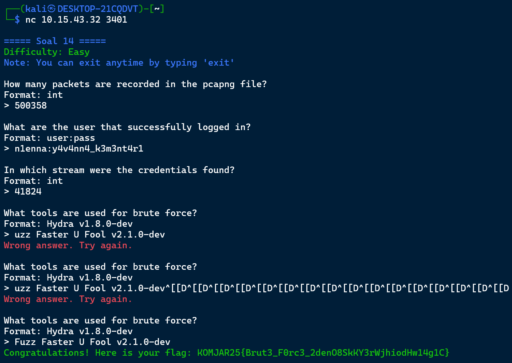

## Soal 15

```c
nc 10.15.43.32 3402
```

## 1 What device does Melkor use? Format: string

#### Step 1

Cari paket GET DESCRIPTOR Response DEVICE. Periksa field `iProduct` atau string descriptor untuk mengetahui nama perangkat (mis. Keyboard). 

#### Answer

```c
Keyboard
```


## 2 What did Melkor write? Format: string

#### Step 1

Filter paket HID dengan:

```c
usb.transfer_type == 0x01
```

Ekspor hasil packet dissections ke file teks, kemudian dekode data HID (hex) dengan skrip `decode_hid.py` untuk mendapatkan teks.

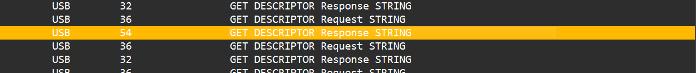

#### Step 2

Jalankan:

```c
python decode_hid.py .\hid_packets.txt > .\keyslogfile.txt
```

untuk menghasilkan pesan yang terenkode. 


#### Answer

```c
UGx6X3ByMHYxZGVfeTB1cl91czNybjRtZV80bmRfcDRzc3cwcmQ=
```

## 3 What is Melkor's secret message? Format: string

#### Step 1

Dekode base64 hasil dari Q2:

```c
echo "UGx6X3ByMHYxZGVfeTB1cl91czNybjRtZV80bmRfcDRzc3cwcmQ=" | base64 --decode
```

untuk mendapatkan pesan asli. 

#### Answer

```c
Plz_pr0v1de_y0ur_us3rn4me_4nd_p4ssw0rd
```

### Flag

```c
Congratulations! Here is your flag: KOMJAR25{K3yb0ard_W4rr10r_BRxsRQ8etjElDYMOJBbksIR0d}
```

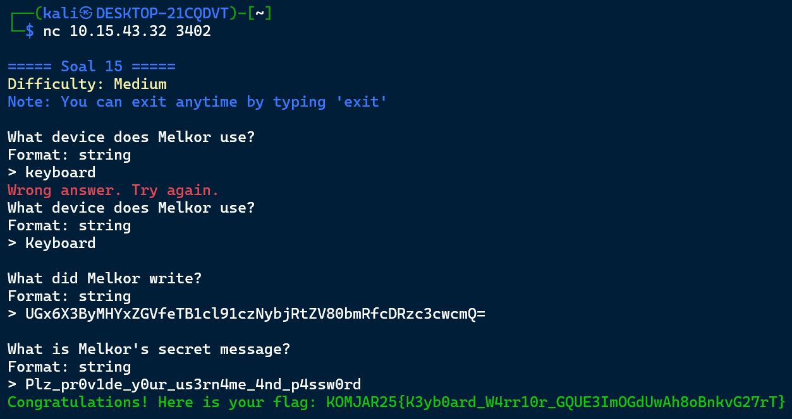

## Soal 16

```c
nc 10.15.43.32 3403
```

## 1 What credential did the attacker use to log in? Format: user:pass

#### Step 1

Gunakan display filter untuk FTP:

```c
ftp.request.command== "USER" || ftp.request.command == "PASS"
```

Lihat paket USER/PASS untuk mendapatkan kredensial login. 

#### Answer

```c
ind@psg420.com:{6r_6e#TfT1p
```


## 2 How many files are suspected of containing malware? Format: int

#### Step 1

Buka percakapan FTP dengan `Follow > TCP Stream` — daftar file yang ditransfer terlihat (q.exe, w.exe, e.exe, r.exe, t.exe). Ini menunjukkan jumlah file yang dicurigai. 

#### Answer

```c
5
```
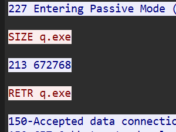
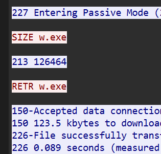
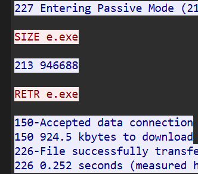
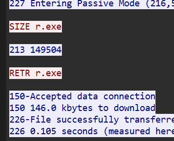
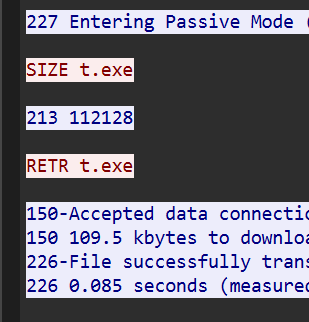

## 3 What is the hash of the first file (q.exe)? Format: sha256

#### Step 1

Dari `Follow TCP Stream` catat response PASV untuk mendapatkan nilai p1 dan p2.

#### Step 2

Hitung port tujuan:

```
port = (p1*256) + p2
```

#### Step 3

Filter koneksi berdasarkan IP server dan port yang dihitung, misalnya:

```c
ip.addr == 216.55.163.106 && tcp.port == 51089
```

ikuti `Follow > TCP Stream` → Save as raw (simpan sebagai q.exe).

#### Step 4

Hitung SHA256 file:

```c
sha256 q.exe
```

#### Answer

```c
ca34b0926cdc3242bbfad1c4a0b42cc2750d90db9a272d92cfb6cb7034d2a3bd
```


## 4 What is the hash of the second file (w.exe)? Format: sha256

#### Step 1

Filter koneksi untuk file kedua:

```c
ip.addr == 216.55.163.106 && tcp.port == 59785
```

ikuti `Follow TCP Stream` → simpan sebagai w.exe.

#### Step 2

Hitung SHA256:

```c
sha256 w.exe
```

#### Answer

```c
08eb941447078ef2c6ad8d91bb2f52256c09657ecd3d5344023edccf7291e9fc
```


## 5 What is the hash of the third file (e.exe)? Format: sha256

#### Step 1

Filter untuk file ketiga:

```c
ip.addr == 216.55.163.106 && tcp.port == 49506
```

ikuti `Follow TCP Stream` → simpan sebagai e.exe.

#### Step 2

Hitung SHA256:

```c
sha256 e.exe
```

#### Answer

```c
32e1b3732cd779af1bf7730d0ec8a7a87a084319f6a0870dc7362a15ddbd3199
```


## 6 What is the hash of the third file (r.exe)? Format: sha256

#### Step 1

Filter untuk file keempat:

```c
ip.addr == 216.55.163.106 && tcp.port == 60899
```

ikuti `Follow TCP Stream` → simpan sebagai r.exe, lalu hitung:

```c
sha256 r.exe
```

#### Answer

```c
4ebd58007ee933a0a8348aee2922904a7110b7fb6a316b1c7fb2c6677e613884
```


## 7 What is the hash of the third file (t.exe)? Format: sha256

#### Step 1

Filter untuk file kelima:

```c
ip.addr == 216.55.163.106 && tcp.port == 50157
```

ikuti `Follow TCP Stream` → simpan sebagai t.exe, lalu hitung:

```c
sha256 t.exe
```

#### Answer

```c
10ce4b79180a2ddd924fdc95951d968191af2ee3b7dfc96dd6a5714dbeae613a
```


### Flag

```c
Congratulations! Here is your flag: KOMJAR25{Y0u_4r3_4_g00d_4nalyz3r_iDYON1mAHIfDzG2S49awKOBRm}
```

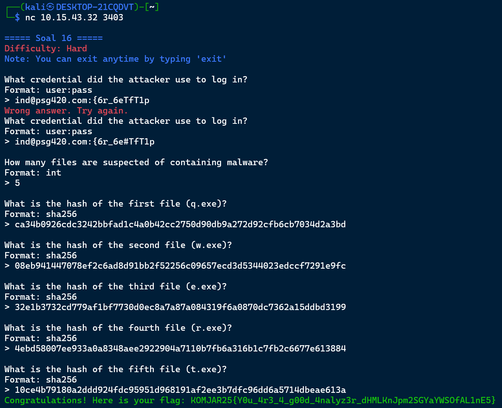

## Soal 17

```c
nc 10.15.43.32 3404
```

## 1 What is the name of the first suspicious file? Format: file.exe

#### Step 1

Gunakan `File > Export Objects > HTTP` untuk mengekspor objek HTTP yang ditransfer.

#### Step 2

Periksa file yang diekspor; salah satunya adalah `Invoice&MSO-Request.doc`. 

#### Answer

```c
Invoice&MSO-Request.doc
```


## 2 What is the name of the second suspicious file? Format: file.exe

#### Step 1

Dengan metode yang sama (`Export Objects > HTTP`) temukan file kedua yang bernama `knr.exe`. 

#### Answer

```c
knr.exe
```


## 3 What is the hash of the second suspicious file (knr.exe)? Format: sha256

#### Step 1

Ekspor file via `File > Export Objects > HTTP` → Simpan `knr.exe`.

#### Step 2

Hitung SHA256 secara lokal:

```c
sha256 knr.exe
```

#### Answer

```c
749e161661290e8a2d190b1a66469744127bc25bf46e5d0c6f2e835f4b92db18
```


### Flag

```c
Congratulations! Here is your flag: KOMJAR25{M4ster_4n4lyzer_1xcg3WUUjKpux80gm8tEdFgL0}
```

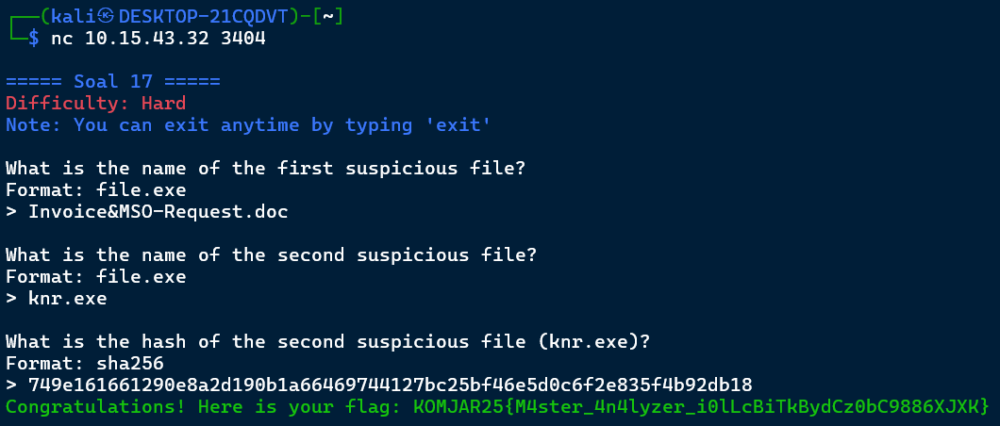

## Soal 18

```c
nc 10.15.43.32 3405
```

## 1 How many files are suspected of containing malware? Format: int

#### Step 1

Gunakan `File > Export Objects > SMB` untuk melihat file SMB yang ditransfer.

#### Step 2

Periksa nama file — dua file menggunakan pola URL-encoded (`%5cWINDOWS%5c...`) yang mencurigakan, biasanya tanda obfuscation. 

#### Answer

```c
2
```


## 2 What is the name of the first malicious file? Format: file.exe

#### Step 1

Dari hasil export SMB, catat nama file pertama yang mencurigakan.

#### Answer

```c
d0p2nc6ka3f_fixhohlycj4ovqfcy_smchzo_ub83urjpphrwahjwhv_o5c0fvf6.exe
```


# 3 Apa nama file berbahaya yang kedua? Format: file.exe

#### Step 1

Dari hasil export SMB, catat nama file kedua yang mencurigakan.

#### Answer

```c
oiku9bu68cxqenfmcsos2aek6t07_guuisgxhllixv8dx2eemqddnhyh46l8n_di.exe
```


## 4 What is the hash of the first malicious file? Format: sha256

#### Step 1

Simpan file dari export SMB, lalu hitung SHA256:

```c
sha256 %5cWINDOWS%5cd0p2nc6ka3f_fixhohlycj4ovqfcy_smchzo_ub83urjpphrwahjwhv_o5c0fvf6.exe
```

#### Answer

```c
59896ae5f3edcb999243c7bfdc0b17eb7fe28f3a66259d797386ea470c010040
```


## 5 What is the hash of the second malicious file? Format: sha256

#### Step 1

Simpan file kedua dari export SMB, lalu hitung SHA256:

```c
sha256 %5cWINDOWS%5coiku9bu68cxqenfmcsos2aek6t07_guuisgxhllixv8dx2eemqddnhyh46l8n_di.exe
```

#### Answer

```c
cf99990bee6c378cbf56239b3cc88276eec348d82740f84e9d5c343751f82560
```


### Flag

```c
Congratulations! Here is your flag: KOMJAR25{Y0u_4re_g0dl1ke_e8XQLgCWiRzzsqZm9XqENF6bY}
```

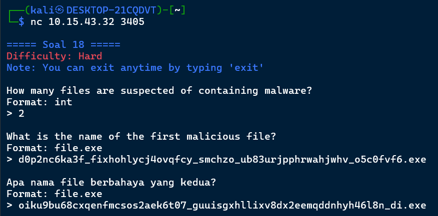
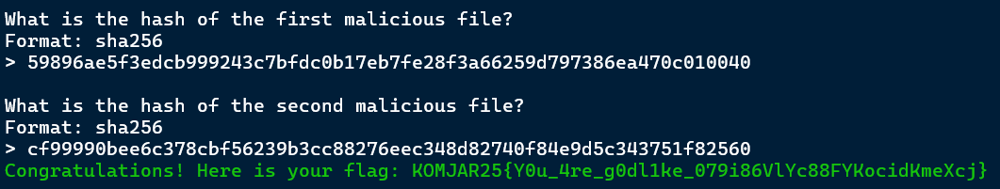


## Soal 19

```c
nc 10.15.43.32 3406
```

## 1 Who sent the threatening message? Format: string (name)

#### Step 1

Filter paket SMTP lalu buka `Follow > TCP Stream` untuk membaca isi email pengirim.

#### Step 2

Baca konten email untuk menemukan nama pengirim. 

#### Answer

```c
Your Life
```


## 2 How much ransom did the attacker demand ($)? Format: int

#### Step 1

Dari isi email (hasil Follow TCP Stream) cari angka permintaan tebusan dalam dolar. 

#### Answer

```c
1600
```


## 3 What is the attacker's bitcoin wallet? Format: string

#### Step 1

Baca isi email (Follow TCP Stream) dan salin alamat wallet BTC yang tercantum. 

#### Answer

```c
1CWHmuF8dHt7HBGx5RKKLgg9QA2GmE3UyL
```


### Flag

```c
Congratulations! Here is your flag: KOMJAR25{Y0u_4re_J4rk0m_G0d_uYgq9qyc7cdrJ2F5gyBt0otqK}
```
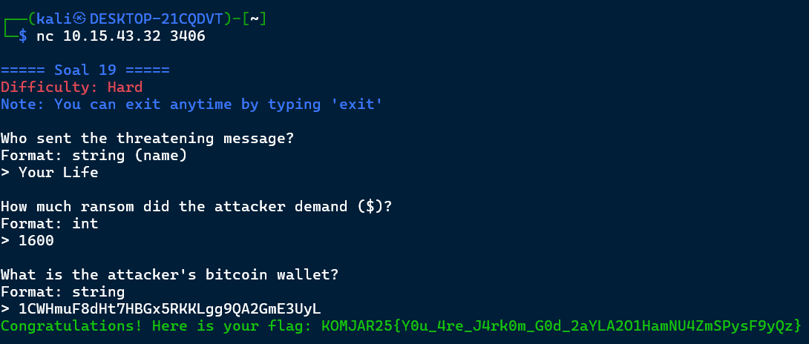


## Soal 20

```c
nc 10.15.43.32 3407
```

## 1 What encryption method is used? Format: string

#### Step 1

Identifikasi protokol TLS dengan display filter:

```c
tls.handshake.type == 2
```

untuk melihat ServerHello dan cipher yang dipilih. 

#### Answer

```c
TLS
```


## 2 What is the name of the malicious file placed by the attacker? Format: file.exe

#### Step 1

Jika tersedia `keylogs.txt`, masukkan pada Wireshark Preferences → TLS supaya Wireshark dapat mendekripsi trafik TLS dan menampilkan isi HTTP.

#### Step 2

Gunakan filter HTTP:

```c
http.response.code == 200
```

ikuti `Follow > TCP Stream` pada respons 200 untuk menemukan nama file yang diunduh (contoh: `invest_20.dll`). 

#### Answer

```c
invest_20.dll
```


### Question 3

What is the hash of the file containing the malware? Format: sha256

#### Step 1

Simpan file yang diekspor (invest_20.dll), lalu hitung SHA256:

```c
sha256 invest_20.dll
```

#### Answer

```c
31cf42b2a7c5c558f44cfc67684cc344c17d4946d3a1e0b2cecb8eb58173cb2f
```


### Flag

```c
Congratulations! H
```


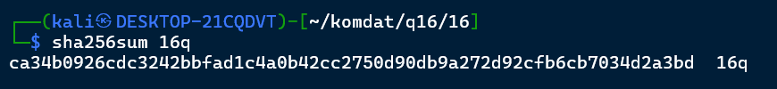

